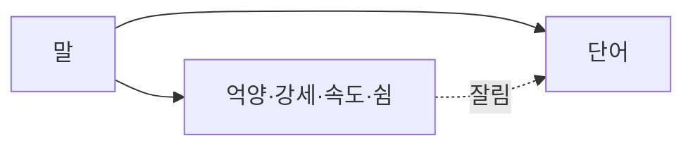

# 본문 마크업 가이드 (xonic789.github.io)

이 블로그(Chirpy 포크)에서 **실제로 렌더되는** 본문 마크업과 사용 기준.
렌더 여부는 `_sass/`·`_layouts/`에 달려 있으므로, 레이아웃을 고치면 이 문서도 같은 커밋에서 고친다.

프론트매터 규칙은 [`FRONTMATTER_POLICY.md`](FRONTMATTER_POLICY.md)에 있다.

## 1. 컬러 콜아웃 (prompt)

인용문 **바로 다음 줄**에 IAL을 붙인다. 라이트·다크 색상이 모두 정의돼 있다
(`_sass/colors/typography-{light,dark}.scss`).

```markdown
> 정보가 없을 때의 기본값은 중립이 아니라 약간 부정 쪽이다.
{: .prompt-tip }
```

| 클래스 | 색 | 용도 |
|---|---|---|
| `{: .prompt-tip }` | 초록 | 핵심 명제, 실천 지침 |
| `{: .prompt-info }` | 파랑 | 배경 설명, 단서, "이건 아직 확정 아님" |
| `{: .prompt-warning }` | 노랑 | 주의, 흔한 오해 |
| `{: .prompt-danger }` | 빨강 | 반례, 하지 말 것 |

**상한: 5,000자당 4~5개.** 더 넣으면 강조가 강조를 죽인다.
본문에서 이미 볼드로 강조한 문장을 콜아웃으로 올릴 때는 볼드를 뺀다 — 이중 강조는 촌스럽다.

## 2. 각주

kramdown 기본 지원. 인용을 본문 흐름에서 빼되 출처는 유지할 때 쓴다.

```markdown
Kruger 연구팀은 2005년에[^kruger] 이메일 실험을 했다.

[^kruger]: Kruger, J. et al. (2005). Egocentrism over e-mail. *JPSP*
```

정의는 문서 맨 아래 모아 둔다. 렌더 시 하단에 자동으로 목록이 생기므로
**별도의 `## 참고` 섹션과 병행하지 않는다** — 같은 내용이 두 번 나온다.

인용이 3건 이상이면 각주, 1~2건이면 본문에 그냥 적는 게 낫다.

## 3. 형광펜 · 취소선 · 키캡

```markdown
문자는 <mark>이 채널을 통째로 잘라낸다</mark>.
~~2026-07-09 가안~~ 철회
<kbd>Ctrl</kbd> + <kbd>C</kbd>
```

`<mark>`는 **논지 전환점에만.** 글 하나에 3개를 넘기지 않는다.
kramdown은 `==하이라이트==` 문법을 지원하지 않으므로 `<mark>` 태그를 쓴다.

## 4. 접기 (details)

긴 로그·에러 스택·부록처럼 "필요한 사람만 펼치면 되는" 덩어리에 쓴다.

```markdown
<details>
<summary>전체 스택 트레이스</summary>

```text
...
```

</details>
```

읽는 흐름에 필요한 내용을 접지 않는다. 각주로 해결되는 것을 접기로 대신하지 않는다.

## 5. 다이어그램 (mermaid)

프론트매터에 `mermaid: true`를 **반드시** 추가해야 로더가 붙는다
(`_includes/js-selector.html`이 `page.mermaid`로 분기).

````markdown
---
mermaid: true
---


````

글의 핵심 메커니즘이 흐름·상태·관계일 때만 쓴다. 목록으로 충분한 것을 그림으로 만들지 않는다.
노드 라벨에 한글·특수문자가 들어가면 `["..."]`로 감싼다.

## 6. 코드 블록

kramdown + rouge. 언어 지정은 항상 한다.

파일 경로는 Chirpy 전용 클래스를 쓴다.

```markdown
`_layouts/post.html`{: .filepath}
```

## 렌더 확인

로컬 빌드 없이 확인할 때는 배포 후 실제 URL을 친다. **빌드 성공은 렌더 성공을 뜻하지 않는다.**

```sh
H=$(curl -s -L "https://xonic789.github.io/posts/<슬러그>/")
echo "$H" | grep -o 'prompt-tip\|prompt-info\|prompt-warning' | sort | uniq -c
echo "$H" | grep -c 'class="footnotes"'
echo "$H" | grep -c 'mermaid'
```
