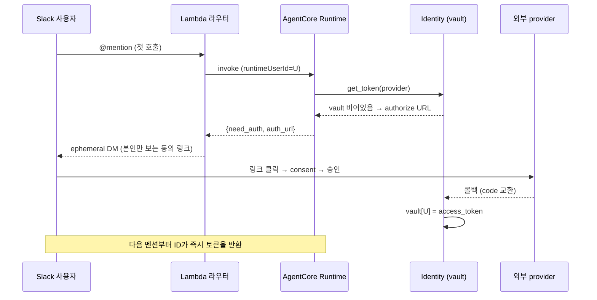
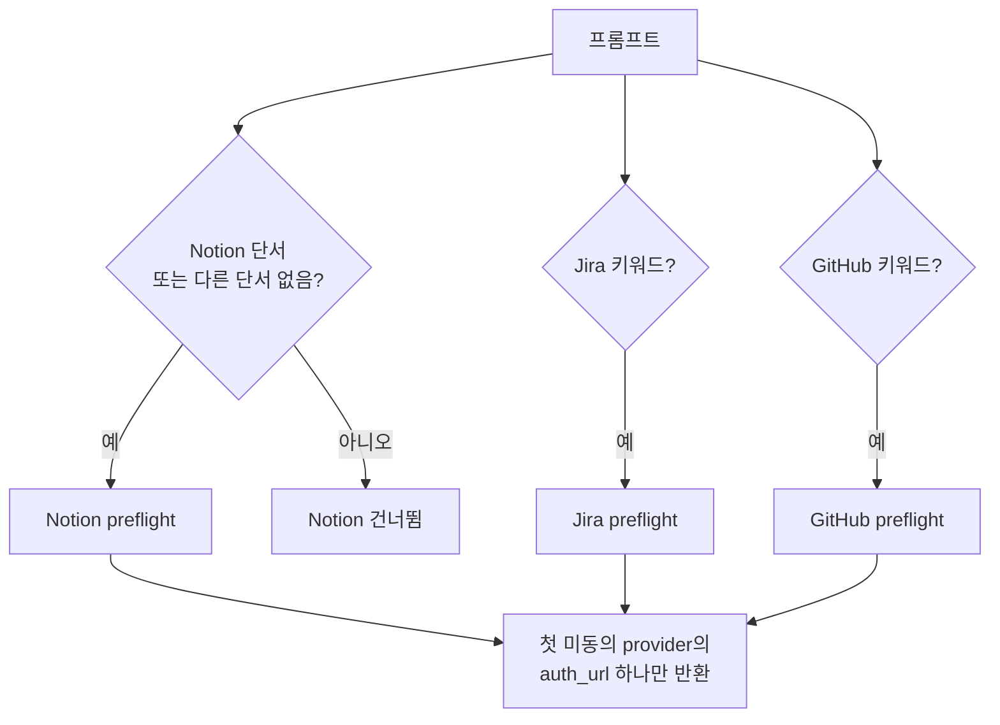

## 문제: 같은 에이전트, 같은 질문, 그런데 답이 달라야 한다

보통 사내 챗봇은 공유 토큰 하나로 돈다. 봇이 Notion에 연결돼 있으면, 누가 물어보든 결국 보게 되는 건 봇 계정이 볼 수 있는 전부다. 임원 회의록이든 인사 문서든, 봇 토큰의 권한 안에 들어 있는 거라면 갓 입사한 사람한테도 똑같이 노출된다.

내가 만들고 싶었던 건 정반대로 도는 에이전트였다.

- A가 물어보면 A 본인의 권한으로 접근할 수 있는 것만 근거로 삼아 답한다.
- B가 똑같이 물어보면 B의 권한 안에서만 답한다.
- 임원이 "이번 주 임원 회의 안건 정리해줘"라고 하면 정리된 답이 돌아오지만, 같은 질문을 권한 없는 사람이 던지면 "접근 가능한 페이지가 없습니다"가 돌아온다.

집합으로 적으면 A가 근거로 삼는 Sₐ와 B의 Sᵦ가 애초에 다르다는 얘기다. 공유 토큰 봇은 이 둘을 구분하지 못해서, 누가 물어보든 똑같이 답하거나 똑같이 막힌다. 결국 차이를 만드는 건 AI 모델이 아니라 그 뒤의 **권한 인프라**다.

이런 사용자별 권한을 구현하는 표준이 3LO(3-legged OAuth)다. 사용자와 에이전트, 그리고 외부 서비스(Notion·Jira·GitHub) 사이에서 사용자가 직접 동의하고, 그렇게 받은 토큰을 안전하게 보관해 뒀다가 그 사람의 요청에만 쓰는 방식이다. 문제는 이걸 맨바닥부터 만들려면 세션 격리, OAuth 토큰 vault, 사용자별 권한 처리, 감사 로그까지 몇 주에서 몇 달은 잡아야 한다는 점이다. 그중에서도 사용자별 OAuth vault는 어떤 프레임워크를 가져다 쓰든 직접 만들기에 가장 비싼 조각이다.

AWS Bedrock AgentCore는 바로 이 인프라를 빌딩블록으로 내준다. Runtime, Identity(토큰 vault + 3LO), Gateway(MCP 허브), Memory. "그럼 이 위에 올리면 며칠이면 되지 않을까?" 하는 게 출발점이었다. 결론부터 말하면, 하루짜리 PoC로 시연한 다음 운영 시스템으로 넘겼다. 다만 그 사이에 들어간 작업의 대부분은 "AgentCore가 알아서 해준다"는 말과 "우리 회사 환경에서 실제로 두 사람한테 다른 답이 나간다"는 현실 사이의 간격을 메우는 일이었다.

## 왜 Slack을 인터페이스로 골랐나

에이전트의 두뇌를 정했다고 끝이 아니다. 사용자가 그 에이전트와 만나는 창구는 별개로 골라야 한다. 후보는 자체 웹 UI, 사내 포털, 그리고 Slack이었고, 결국 Slack으로 기운 이유는 분명했다.

- **전 직군이 이미 거기 상주한다.** 대상이 개발자만이 아니라 회사 구성원 전체였는데, 새 UI를 만들어 설치하고 교육하는 비용이 거의 0에 가까운 채널은 Slack뿐이었다. 도입 마찰이 가장 낮은 곳에 두느냐가 결국 채택률을 가른다.
- **멘션과 스레드가 세션 경계에 그대로 들어맞는다.** 스레드 하나가 대화 세션이고, 멘션한 사람이 actor다. 이걸 런타임의 `runtimeSessionId`(스레드)와 actor(사용자)에 그대로 매핑하면 세션 격리와 사용자 식별이 덤으로 따라온다.
- **3LO 동의 UX가 깔끔하게 풀린다.** 사용자별 권한의 핵심은 본인에게만 보이는 동의 링크를 보내는 건데, Slack의 ephemeral 메시지가 딱 그 역할을 한다. 같은 채널 안에서도 A에겐 A의 링크만, B에겐 B의 링크만 띄울 수 있다.
- **인바운드 보안 표면이 작다.** 초기엔 Socket Mode를 써서 공개 인바운드 엔드포인트가 아예 없었다(운영에 올리면서 Events API로 바꿨다). 외부에서 직접 두드릴 표면이 없다는 건 사내 도구에선 꽤 큰 보안 자산이다.

대안을 같이 놓고 보면 이 선택이 더 또렷해진다. 사내 자동화는 보통 두 갈래다. 한쪽은 n8n 같은 결정론적 워크플로우, 트리거와 액션이 고정된 자동화다. 다른 한쪽은 Slack에 붙은 코딩 전용 어시스턴트, 개발자가 코드 작업을 시키는 봇이다. 그런데 그 사이에 빈칸이 하나 있었다. 전 직군이 자연어로 회사 시스템을 직접 움직이는 단일 창구다. 결정론적 워크플로우는 자유로운 자연어 요청을 받아내지 못하고, 코딩 어시스턴트는 코드와 단일 레포에 묶여 있다. 그 빈칸을 Slack 위의 권한 분리 에이전트로 채운 셈이다.

## 아키텍처


이 글에서 다루는 에이전트는 하나다. Notion·Jira·GitHub를 넘나드는 사용자별 3LO 에이전트. 처음 부르면 본인에게만 보이는 동의 링크(ephemeral DM)를 보내고, 한 번 승인해 두면 그다음부턴 vault에서 토큰을 바로 꺼내 쓴다. 프롬프트가 가리키는 provider만 골라 동의를 받기 때문에, Notion만 쓸 사람을 Jira나 GitHub 동의로 끌고 가지 않는다.

라우터는 Slack과 AgentCore 사이를 잇는 어댑터다. AgentCore가 Slack 이벤트를 직접 받지 못하니 이 계층은 없앨 수가 없다. "얇은 변환기" 정도로 부르고 싶지만, 실제로는 멘션 중복 제거, OAuth 동의 세션 등록, 사용자별 토큰 민팅, 런타임 라우팅, Assistant 패널 UX까지 손대는 일이 꽤 많다. 그래도 컴퓨트 자체는 상태를 들고 있지 않다. 중복 제거 키나 OAuth 세션 바인딩 같은 상태는 전부 DynamoDB에 빼 둬서, Lambda 인스턴스가 죽었다 살아나도 멀쩡하다.

"같은 에이전트, 다른 답"을 떠받치는 사용자별 3LO는 첫 호출에서 딱 한 번 일어난다. 에이전트가 어떤 provider의 토큰을 vault에서 못 찾으면, 답 대신 본인에게만 보이는 동의 링크를 돌려준다.



## 그래서, 이걸로 뭘 하나

여기까지가 "어떻게 도는가"였다. 정작 중요한 건 사용자가 Slack에서 실제로 뭘 받느냐다. 말로 "권한대로 답이 달라진다"고 하는 것보다, 같은 질문을 던진 두 사람의 화면을 나란히 보는 게 빠르다.

> **김이사** — `@agent 이번 주 임원회의 결정사항 요약해줘`
> 🤖 접근 가능한 회의록 3건에서 결정만 추렸습니다 — ① 채용 일정 조정 ② 예산 재배분 ③ …
>
> **박신입** — `@agent 이번 주 임원회의 결정사항 요약해줘`
> 🤖 접근 가능한 페이지가 없습니다.

질문도, 에이전트도, 모델도 같다. 다른 건 각자의 Notion 권한뿐이다. 김이사는 본인이 볼 수 있는 회의록 위에서 답을 받고, 박신입은 애초에 근거가 없으니 막힌다. 글 첫머리에서 말한 Sₐ ≠ Sᵦ가 실제로 작동하는 장면이다.

권한 분리는 막는 것만이 아니다. 본인 권한 안에서 여러 도구를 가로질러 묶어 주는 게 더 일상적인 쓸모다.

> `@agent 내가 이번 스프린트에 맡은 Jira 이슈, 연결된 PR이랑 같이 정리해줘`
> 🤖 진행 중 3건 — PROJ-142 (PR #88, 리뷰 대기) · PROJ-150 (PR #91, 머지됨) · PROJ-161 (PR 없음)

> `@agent 이 GitHub 이슈랑 연결된 Notion 스펙 문서 찾아서 같이 보여줘`
> 🤖 #412와 엮인 스펙 2건입니다 — "결제 재시도 정책" · "웹훅 재전송 설계"

Jira 이슈도, GitHub PR도, Notion 문서도 전부 *그 사람의 토큰*으로 조회된다. 그래서 옆자리 동료가 같은 명령을 쳐도 자기 권한 안의 결과만 받는다. 공유 토큰 봇으로는 안 되는 동작이다.

여기서부터가 진짜 본론이다. 권한 분리를 실제로 굴리면서 밟은 함정들을, 다음 사람은 덜 헤매라고 정리해 둔다.

## "Notion MCP"의 OAuth 서버는 "Notion REST API"의 OAuth 서버가 아니다

가장 많은 시간을 태운 함정이다. AWS 공식 문서가 시키는 대로 `NotionOauth2` provider로 credential provider를 만들었고, 사용자 OAuth도 성공해서 vault에 토큰까지 들어갔다. 그런데 정작 그 토큰으로 `mcp.notion.com/mcp`를 호출하면 **401 Unauthorized**가 떨어졌다.

원인은 어이없게도, 같은 "Notion"인데 OAuth 서버가 **둘로 갈라져** 있다는 거였다.

| 용도 | OAuth 서버 | 토큰 호환 |
|---|---|---|
| Notion REST API (`api.notion.com/v1/*`) | `api.notion.com/v1/oauth/*` | REST 전용 |
| Notion MCP (`mcp.notion.com/mcp`) | `mcp.notion.com/*` (자체 서버) | MCP 전용 |

AWS 빌트인 `NotionOauth2`가 가리키는 건 REST API 쪽이라, MCP 서버 입장에선 그 토큰이 남의 토큰인 셈이고 그래서 거부한다. `mcp.notion.com/.well-known/oauth-authorization-server`를 까 보면 issuer도 authorization도 token endpoint도 전부 `mcp.notion.com` 자기 자신으로 잡혀 있다. 결국 해결은 `mcp.notion.com`의 Dynamic Client Registration(RFC 7591)으로 client를 직접 등록하고, `CustomOauth2` provider에 그 endpoint를 박아 넣는 거였다.

> 이건 누구나 공개로 확인할 수 있다. `curl https://mcp.notion.com/.well-known/oauth-authorization-server`를 때려 보면 `issuer`·`authorization_endpoint`·`token_endpoint`·`registration_endpoint`가 죄다 `mcp.notion.com`으로 나온다(`api.notion.com`이 아니다). `registration_endpoint`(`/register`)가 있다는 것 자체가 RFC 7591 동적 등록을 쓸 수 있다는 신호다.

교훈은 간단하다. **MCP 서버와 그 서비스의 REST API가 같은 OAuth를 쓸 거라고 지레짐작하지 말 것.** 외부 OAuth를 붙이기 전에 `/.well-known/oauth-authorization-server`부터 열어 보면 된다. 나는 이걸 늦게 봐서 다섯 시간을 날렸다.

## provider를 늘리며 — Jira와 GitHub 3LO의 서로 다른 함정

Notion 하나가 돌기 시작하니 Jira와 GitHub를 붙일 차례였다(Jira는 read만이 아니라 write까지 열었다). 좋은 소식은, 게이트웨이 허브에 provider를 더하는 일이 거의 정형화된다는 점이다. OpenAPI 타깃 등록, 네이티브 credential provider, 동의 체이닝 한 줄, 그리고 프롬프트 게이팅이면 끝이고 런타임 코드는 거의 손댈 일이 없다. 나쁜 소식은, provider마다 OAuth의 성격이 달라서 같은 레시피를 써도 걸리는 지점이 제각각이라는 점이다.

먼저 **Atlassian(Jira)**. 함정이 둘이었다.

- **앱 Distribution을 Sharing으로 바꿔야 한다.** 개발 모드 그대로 두면 앱 소유자 본인만 인증되고, 다른 사용자는 동의 화면에서 "You don't have access"를 만난다. 나는 되는데 동료는 안 되는 전형적인 증상이다.
- **`offline_access` scope가 필수다.** 이게 빠지면 access token이 한 시간쯤 뒤에 만료되는데 refresh가 안 되니 사용자가 계속 다시 인증해야 한다. "배포할 때마다 인증이 풀리는 것 같다"던 증상의 진짜 범인이 이거였다. 배포랑은 아무 상관이 없었다.

> 둘 다 Atlassian 공식 OAuth 2.0 (3LO) 문서에 그대로 나온다. 앱은 기본이 private("only you can install and use it")이라 다른 사용자에게 열려면 sharing(distribution)을 켜야 하고, refresh token을 받으려면 authorization URL의 `scope`에 `offline_access`를 넣어야 한다. ([developer.atlassian.com](https://developer.atlassian.com/cloud/jira/platform/oauth-2-3lo-apps/))

**GitHub은 한결 수월했다.** base URL이 `api.github.com`으로 고정이라 Atlassian의 cloudId 같은 추가 식별자가 필요 없고, OAuth App 토큰은 만료되지 않으니 `offline_access`를 신경 쓸 일도 없다. 딱 하나, 조직이 소유한 private 레포는 조직 차원에서 OAuth App 접근을 승인해 줘야 비로소 보인다(public 레포는 그럴 필요 없다).

**동의 체이닝과 게이팅**도 손봐야 했다. 처음엔 Notion을 늘 1순위로 preflight했더니, GitHub나 Jira만 쓰려던 사람한테도 Notion 동의부터 떴다("얘는 왜 자꾸 노션을 물어보지"). 그래서 프롬프트가 가리키는 provider만 동의를 받도록 게이팅을 걸었다. Notion 단서가 있거나, 다른 provider 단서가 전혀 없을 때만 Notion을 preflight한다. provider가 늘어날수록 필요한 동의만 한 번에 하나씩 받아내는 흐름이 점점 중요해진다.



여기에 멀티턴에서만 튀어나오는 함정이 하나 더 있었다. provider 키워드가 없는 후속 턴은 preflight를 건너뛰는데, 그러면 미인증 상태로 도구를 부르다가 런타임 중간에 에러가 난다. 이때 모델이 동의 URL을 그냥 일반 답변 텍스트에 흘려보내는 일이 가끔 있었다. 문제는 그 URL이 평범한 메시지로 게시되는 순간 일회용 인증 링크가 소비돼 버려서 인증이 깨진다는 거였다. 그래서 런타임이 답변 안에서 authorize URL을 발견하면, 정상 `need_auth` 경로(라우터가 세션을 등록하고 링크 unfurl을 끄는 경로)로 끌어오도록 고쳤다.

운영에 들어가기 전에 알아 둘 제약이 하나 있다. **AgentCore에는 사용자별·provider별로 토큰을 지우는 API가 없다.** 그래서 "Jira만 다시 동의받기" 같은 게 안 되고, 특정 사용자의 토큰을 비우려면 신원 자체를 새로 발급하는 전체 reset밖에 길이 없다. provider를 여럿 굴릴 거라면 reauth 전략을 미리 정해 두는 편이 낫다.

## 모든 걸 3LO로 붙이면 안 된다 — 구글 캘린더는 일부러 공유 계정으로

네 번째 provider로 구글 캘린더를 붙일 차례였는데, 여기서 방향을 정반대로 틀었다. 앞의 셋(Notion·Jira·GitHub)이 전부 사용자별 3LO였다면, 캘린더는 **일부러 공유 서비스 계정**으로 갔다.

이유는 두 가지다. 첫째, 갖다 쓸 만한 Calendar MCP는 죄다 per-user OAuth에 브라우저 동의를 요구하고 headless를 지원하지 않는다. 무인으로 도는 런타임엔 애초에 맞지 않는다. 둘째, 회의를 만들고 참석자에게 초대(RSVP)를 보내려면 주최자가 **실제 사용자**여야 한다. 순수 서비스 계정으로는 초대 메일이 나가지 않는다. 그래서 GCP 서비스 계정에 **도메인 전체 위임(Domain-Wide Delegation)**을 걸어, 사내 워크스페이스 계정 하나를 임퍼소네이트하는 방식으로 풀었다.

결과적으로 캘린더는 게이트웨이도, Identity 토큰 vault도 거치지 않는다. 런타임 안에서 google-auth로 토큰을 직접 민팅하고, 동의 게이팅도 없이 항상 켜져 있다. "사용자별로 답이 달라야 한다"던 이 시스템에서, 캘린더만큼은 모두가 같은 계정으로 접근한다 — 의도적으로.

여기에도 구글 특유의 함정이 하나 있었다. **DWD는 스코프를 정확히 문자열로 매칭하고, 요청한 스코프가 전부 사전 승인돼 있어야 토큰이 발급된다.** 하나라도 빠지면 토큰 민팅 전체가 실패한다. 그래서 쓰기(`calendar.events`)와 읽기(`calendar.readonly`, `calendar.freebusy`)를 **별도 자격증명으로 쪼갰다.** 회의실 free/busy 조회 같은 읽기 스코프가 빠져도, 핵심인 회의 생성은 오래전부터 승인돼 있던 `calendar.events` 하나로만 돌아 죽지 않는다.

나머지는 자잘한 마감이다. 참석자는 사내 도메인 사용자나 회의실 리소스 캘린더만 허용하고(외부 주소는 조용히 드롭한다), Google Meet 링크를 붙이려면 insert 호출에 `conferenceDataVersion=1`을 같이 넘겨야 한다.

정리하면 캘린더는 사용자별 격리를 포기하는 대신 운영 단순성과 RSVP 발송을 얻은 트레이드오프다. 권한 분리가 이 글의 핵심이지만, **모든 통합에 같은 패턴을 박는 게 정답은 아니다.** per-user 3LO의 비용(헤드리스에서 받을 수 없는 브라우저 동의)을 캘린더가 감당할 수 없으니, 거기선 공유 계정이 맞는 답이었다.

## 3LO 콜백을 막은 건 IAM이 아니라 조직 SCP였다

콜백을 받을 엔드포인트로 Lambda Function URL(`AuthType=NONE`)을 IaC로 다 깔아 놨는데, 외부에서 호출하면 `403 Forbidden`이 떨어졌다. IAM도 리소스 정책도 다 맞는데 막히니 답답했다. 게다가 SigV4로 invoke하면 200이 나오니 더 헷갈렸다.

범인은 회사 AWS Organization의 SCP(Service Control Policy)였다. unauthenticated Lambda Function URL을 조직 차원에서 막고 있었던 것이다. IAM보다 위에 있는 정책이라 우리 쪽에서 풀 수 있는 게 아니었다(보안팀 영역이다). 해결은 앞에 **API Gateway HTTP API**를 한 겹 두는 거였다. 같은 SCP가 거기까지 막는 경우는 드물었다.

교훈을 정리하면, 회사 환경에서 처음 쓰는 AWS 기능(Function URL 같은)은 IaC를 본격적으로 짜기 **전에** 권한부터 한 번 찔러 보는 게 맞다. SCP는 늦게 발견할수록 되돌릴 게 많아진다.

## 콜백 인프라를 provider마다 만들지 마라

OAuth 콜백 처리를 Notion 전용으로 짜고 싶은 유혹이 든다. 하지만 AgentCore의 토큰 교환 완료 API(`complete_resource_token_auth`)는 session 식별자와 user 식별자만 받는, **모든 vendor에 공통인** 호출이다. 그러니 콜백 인프라는 provider에 안 묶이게 딱 한 번만 만들면 된다.

```
라우터(pre-flight): DDB put { session_uri, user_id, provider, ttl=600s }
OAuth redirect chain → AgentCore 콜백 → Lambda
Lambda: DDB get(session_uri)로 user_id 회수
      → complete_resource_token_auth(session_uri, user_id)
      → DDB delete (replay 방지)
```

- `session_uri`가 추측할 수 없는 랜덤 URN이라, OAuth code나 state와 같은 등급으로 다룰 수 있다.
- **provider를 추가하는 비용이 사실상 0**이다. 새 credential provider만 만들면 Lambda·DDB·API Gateway는 그대로 재사용한다. 실제로 앞에서 Jira와 GitHub를 붙일 때 콜백 코드는 한 줄도 건드리지 않았다.

## 사용자 ID 좌표가 5개이고, 규칙이 제각각이다

사용자 한 명을 추적하는 식별자가 레이어마다 이름도 다르고 제약도 다르다. 이걸 한 번 표로 정리해 두지 않으면, 같은 사용자의 세션을 못 찾는 버그에 시달리게 된다.

| 좌표 | 위치 | 제약 |
|---|---|---|
| `runtimeSessionId` | invoke 인자 | 점(`.`) 허용, 최소 33자 |
| `runtimeUserId` | invoke 인자 | vault 키. **에이전트 코드가 못 읽음** |
| `payload.actor_id` | payload | 에이전트가 Memory actor로 사용 |
| Memory `sessionId` | 에이전트 내부 | **점 거부** → `replace('.', '_')` 필요 |
| Memory `actor_id` | 에이전트 내부 | **점 거부** → sanitize 필요 |

여기서 함정이 둘 겹친다. 첫째, Slack `thread_ts`(`1779....566729`)에 든 점을 Memory `sessionId`에 그대로 넣으면 정규식에 걸려 곧장 실패한다. 둘째, `runtimeUserId` 헤더는 SDK의 forwardable allowlist에 없어서 에이전트 코드가 직접 읽지 못한다. 결국 라우터가 같은 값을 payload에도 한 번 더 실어 보내야 Memory actor나 로그 태깅에 쓸 수 있다.

## 마이그레이션하면 IAM의 Resource ARN이 옛 리전에 박혀 있다

한 리전에서 만든 Runtime을 다른 리전으로 옮겼더니, CloudWatch 로그가 안 흐르고 secrets read가 실패했다. Terraform에서 `${var.region}`만 바꿔도, 이미 살아 있는 role의 inline policy에 박힌 Resource ARN은 옛 리전 그대로 남아 있었던 것이다(다음 apply 때나 갱신된다). 결국 마이그레이션 뒤에 role 정책을 명시적으로 갈아 끼우는 보조 스크립트를 따로 둬야 했다.

이 밖에도 토큰 교환 완료를 호출하는 쪽 IAM에 의외로 Secrets Manager 권한이 필요하다든가, Memory 권한이 `ListEvents`만으론 모자란다든가 하는 함정이 더 있었다. 다 따져 보면 공통점은 하나다. "문서엔 한 줄"인 것과 "실제로 도는 것" 사이의 거리.

## PoC에서 운영으로 — 프레임워크 추상화를 버린 이유

데모야 노트북에서 도는 라우터로 통과했지만, 운영은 또 다른 얘기였다. 로컬 Socket Mode 라우터는 노트북 자체가 SPOF다. 그래서 서버리스(Events API + Lambda)로 컷오버했는데, 여기서 교훈을 하나 더 주웠다.

Slack의 Assistant(AI 패널) 메시지에만 답이 안 오는 문제가 있었다. 채널 멘션은 멀쩡한데 패널만 먹통이었다. 이번엔 추측 대신 **카운팅으로** 범위를 좁혔다. 같은 입력을 두 경로로 흘려보내고 CloudWatch의 invoke 로그 건수를 세 봤더니 딱 한 건, 채널 쪽만 찍혀 있었다. 어딘가에서 한 경로가 메시지를 삼키고 있었던 것이다. self-invoke 202가 뜨는지로 lazy 디스패치를 확인하고, 공식 API 소스까지 들춰 미들웨어 동작을 확정했다.

근본 원인은 프레임워크 래퍼, 그러니까 Slack Bolt의 `Assistant` 클래스가 Lambda + lazy 환경에서 제대로 돌지 않는다는 거였다. 결론은 이렇게 정리됐다. **패턴(이벤트 구독 + Web API 직접 호출)은 살리되, 프레임워크 추상화는 걷어내는 편이 FaaS에선 더 단단하다.** 심볼이 존재한다고 해서 FaaS에서도 동작하는 건 아니다.

운영에서 한 번 더 발목을 잡은 건 **세션 어피니티**였다. `runtimeSessionId`(= Slack 스레드)가 특정 컨테이너에 묶이기 때문에, 재배포를 해도 이미 살아 있던 스레드는 옛 코드를 담은 warm 컨테이너를 계속 붙들고 있다. 그래서 새 코드를 검증하거나 적용하려면 반드시 **새 스레드**에서 해야 한다. "분명히 고쳤는데 왜 그대로지" 했던 게, 알고 보니 옛 스레드의 구버전 컨테이너였던 적이 있다.

여기에 운영을 편하게 해 줄 장치를 몇 개 더 얹었다.

- **GitHub Actions 기반 배포** — `main` 머지(즉 PR 리뷰)가 곧 배포 게이트이고, OIDC로 role을 assume하니 장기 키를 들고 있을 필요가 없다. 특정 에이전트만 골라 배포할 땐 `workflow_dispatch`로 수동으로 돌린다.
- **재배포 없이 바뀌는 프롬프트와 스킬** — 시스템 프롬프트와 Agent Skills(SKILL.md)를 S3 객체로 두고 60초 TTL로 반영한다. 런타임은 S3만 읽으면 되니 소스 레포를 알 필요가 없고, 스킬 내용 변경은 PR 머지로 흘러 들어간다(영구 변경은 PR로만 처리해서 드리프트를 막는다).

## 마치며

토큰 비용은 어디로 가도 똑같다. AgentCore가 실제로 아껴 준 건 OAuth vault와 사용자별 Identity, Memory를 맨손으로 짓는 데 들었을 몇 주에서 몇 달이다. 그중에서도 "같은 에이전트, 다른 답"을 가능하게 하는 사용자별 토큰 vault는, 직접 만들면 가장 비싸고 가장 틀리기 쉬운 조각이다.

그렇다고 공짜로 굴러온 건 아니다. 위에 늘어놓은 함정 대부분은 "AgentCore가 알아서 해준다"는 말과 "실제로 두 사람한테 다른 답이 나간다"는 결과 사이의 거리였다. 그 거리를 메우는 게 이 프로젝트의 진짜 작업이었고, 이 글은 그 지도쯤 된다.
