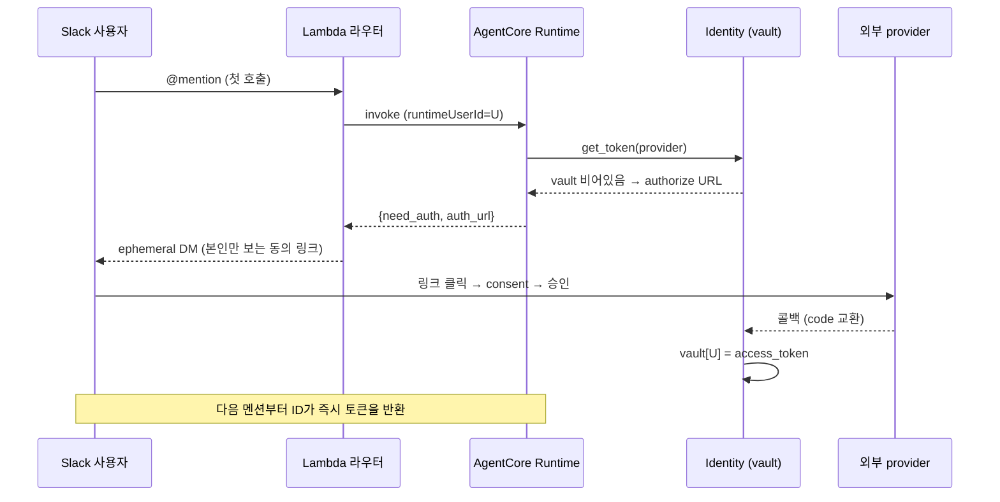
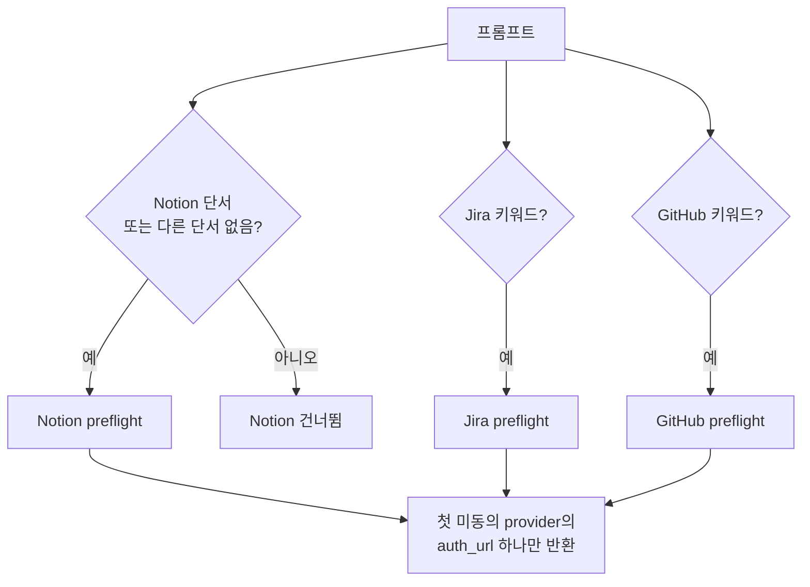

## 문제: 같은 에이전트, 같은 질문, 그런데 답이 달라야 한다

흔한 사내 챗봇은 공유 토큰 하나로 동작한다. 봇이 Notion에 붙어 있으면, 그것에게 물어본 사람이 누구든 **봇 계정이 볼 수 있는 전부**를 보게 된다. 임원 회의록도, 인사 문서도, 봇 토큰의 권한 안이라면 신입에게도 그대로 노출된다.

만들고 싶었던 건 정반대로 동작하는 에이전트다.

- A가 물어보면 → **A 본인의 권한으로** 접근 가능한 것만 인용해 답한다.
- B가 같은 질문을 하면 → **B 본인의 권한** 안에서만 답한다.
- 임원이 "이번 주 임원 회의 안건 정리해줘" 하면 정리된 답이 오고, 그 권한이 없는 사람이 같은 질문을 하면 "접근 가능한 페이지가 없습니다"가 온다.

집합으로 쓰면 A가 보는 근거 집합 Sₐ와 B의 Sᵦ가 다르다. 시중의 공유 토큰 봇은 둘 다 같은 답을 하거나 둘 다 막힌다. 차이는 AI 모델이 아니라 **권한 인프라**에 있다.

이 "사용자별 권한"을 구현하는 표준이 3LO(3-legged OAuth)다. 사용자 ↔ 에이전트 ↔ 외부 서비스(Notion·Jira·GitHub) 사이에서 사용자가 직접 동의하고, 그 사용자 토큰을 안전하게 보관했다가 그 사람의 요청에만 쓰는 흐름이다. 이걸 직접 만들려면 세션 격리, OAuth 토큰 vault, 사용자별 권한 처리, 감사 로그를 몇 주~몇 달 짜야 한다. 특히 사용자별 OAuth vault는 어떤 에이전트 프레임워크를 가져다 써도 직접 만들기 가장 비싼 인프라다.

AWS Bedrock AgentCore는 이 인프라를 빌딩블록으로 제공한다 — Runtime, Identity(토큰 vault + 3LO), Gateway(MCP 허브), Memory. 그래서 "이 위에 올리면 며칠 만에 되지 않을까"가 출발점이었다. 결론부터 말하면 1일 PoC로 시연한 뒤 운영 시스템으로 전환했고, 그 과정의 실제 작업 대부분은 "AgentCore가 해준다"와 "내 회사 환경에서 실제로 두 사용자에게 다른 답이 나간다" 사이의 거리를 메우는 일이었다.

## 왜 Slack을 인터페이스로 골랐나

에이전트의 두뇌가 정해져도 사용자가 그것과 만나는 창구는 따로 고른다. 후보는 자체 웹 UI, 사내 포털, 그리고 Slack이었다. Slack을 고른 이유는 분명했다.

- **전 직군이 이미 거기에 상주한다.** 대상이 개발자만이 아니라 회사 구성원 전체였다. 새 UI를 만들고 설치·교육시키는 비용이 0에 가까운 채널은 Slack뿐이었다. 도입 마찰이 가장 낮은 곳에 에이전트를 두는 게 채택률을 좌우한다.
- **멘션과 스레드가 세션 경계로 자연스럽게 매핑된다.** 스레드 하나가 대화 세션, 멘션한 사람이 actor다. 이걸 그대로 런타임의 `runtimeSessionId`(스레드)와 actor(사용자)에 매핑하면 세션 격리와 사용자 식별이 공짜로 따라온다.
- **3LO 동의 UX가 깔끔하게 풀린다.** 사용자별 권한의 핵심은 "본인에게만 보이는 동의 링크"를 보내는 것인데, Slack의 ephemeral 메시지가 정확히 그 기능이다. 같은 채널에서 A에게는 A의 동의 링크만, B에게는 B의 링크만 보낸다.
- **인바운드 보안 표면이 작다.** 초기엔 Socket Mode를 써서 공개 인바운드 엔드포인트가 0이었다(운영 단계에서 Events API로 전환). 외부에서 직접 때릴 표면이 없다는 건 사내 도구의 첫 보안 자산이다.

대안을 함께 따져보면 이 선택이 더 또렷해진다. 사내 자동화에는 보통 두 축이 있다. 한쪽은 n8n 같은 **결정론적 워크플로우** — 트리거와 액션이 고정된 자동화. 다른 한쪽은 Slack에 붙은 **코딩 전용 어시스턴트** — 개발자가 코드 작업을 시키는 봇. 그 사이에 비어 있던 칸이 바로 *전 직군이 자연어로 회사 시스템에 액션을 가하는 단일 인터페이스*였다. 결정론적 워크플로우는 자연어 액션에 맞지 않고, 코딩 어시스턴트는 코딩·단일 레포에 묶여 있다. 그 빈칸을 Slack 위의 권한 분리 에이전트로 메웠다.

## 아키텍처


권한 모델을 대비시키려고 두 종류의 에이전트를 만들었다.

- **범용 에이전트** — Notion·Jira·GitHub를 가로지르는 사용자별 3LO 에이전트. 처음 부르면 *본인에게만 보이는* 동의 링크(ephemeral DM)를 보내고, 한 번 승인하면 다음부턴 vault에서 바로 토큰을 꺼내 쓴다. 프롬프트가 가리키는 provider만 골라 동의를 받기 때문에, Notion만 쓰는 사람을 Jira/GitHub 동의로 끌고 가지 않는다.
- **도메인 에이전트** — 특정 도메인의 여러 레포를 read-only로 가로지르는 GitHub 에이전트. "앱에서 X가 안 떠" 같은 질문에 여러 플랫폼 레포(iOS/Android/Frontend/Backend)를 cross-repo로 뒤져 PR 번호·파일 경로를 인용해 원인을 추정한다.

라우터는 Slack과 AgentCore 사이의 어댑터다. AgentCore가 Slack 이벤트를 직접 받지 못하기 때문에 이 계층은 사라지지 않는다. "얇은 변환기"라고 부르고 싶지만 실제로는 멘션 중복 제거, OAuth 동의 세션 등록, 사용자별 토큰 민팅, 런타임 라우팅, Assistant 패널 UX까지 꽤 많은 일을 한다. 다만 *컴퓨트 자체는 상태를 들고 있지 않다* — 중복 제거 키나 OAuth 세션 바인딩 같은 상태는 전부 DynamoDB에 둬서, Lambda 인스턴스가 죽고 살아도 안전하다.

"같은 에이전트, 다른 답"의 핵심인 사용자별 3LO는 첫 호출에서 한 번만 일어난다. 에이전트가 어떤 provider의 토큰을 vault에서 못 찾으면, 답 대신 *본인에게만 보이는 동의 링크*를 돌려준다.



여기서부터가 본론이다. 권한 분리를 실제로 굴리며 만난 함정들을, 다음 사람이 안 헛돌게 정리한다.

## "Notion MCP"의 OAuth 서버는 "Notion REST API"의 OAuth 서버가 아니다

가장 많은 시간을 태운 함정이다. AWS 공식 문서가 안내하는 `NotionOauth2` provider로 credential provider를 만들고, 사용자 OAuth까지 성공해서 vault에 토큰이 들어갔다. 그런데 그 토큰으로 `mcp.notion.com/mcp`를 호출하면 **401 Unauthorized**가 떨어졌다.

원인은 같은 "Notion"인데 OAuth 서버가 **둘로 분리**되어 있다는 것이었다.

| 용도 | OAuth 서버 | 토큰 호환 |
|---|---|---|
| Notion REST API (`api.notion.com/v1/*`) | `api.notion.com/v1/oauth/*` | REST 전용 |
| Notion MCP (`mcp.notion.com/mcp`) | `mcp.notion.com/*` (자체 서버) | MCP 전용 |

AWS 빌트인 `NotionOauth2`가 가리키는 건 REST API 쪽이라, MCP 서버는 그 토큰을 거부한다. `mcp.notion.com/.well-known/oauth-authorization-server`를 보면 issuer/authorization/token endpoint가 전부 `mcp.notion.com` 자체로 잡혀 있다. 해결은 `mcp.notion.com`의 Dynamic Client Registration(RFC 7591)으로 직접 client를 등록하고, `CustomOauth2` provider로 그 endpoint를 박는 것이었다.

> 누구나 공개로 확인할 수 있다 — `curl https://mcp.notion.com/.well-known/oauth-authorization-server` 하면 `issuer`·`authorization_endpoint`·`token_endpoint`·`registration_endpoint`가 모두 `mcp.notion.com`으로 떨어진다(`api.notion.com`이 아니다). `registration_endpoint`(`/register`)가 존재한다는 것 자체가 RFC 7591 동적 등록을 쓸 수 있다는 뜻이다.

일반화하면 이렇다. **"MCP 서버"와 "그 서비스의 REST API"가 같은 OAuth를 쓸 거라고 가정하지 말 것.** 외부 OAuth를 셋업하기 전에 `/.well-known/oauth-authorization-server`부터 확인하라. 이걸 일찍 봤으면 다섯 시간을 아꼈다.

## provider를 늘리며 — Jira와 GitHub 3LO의 서로 다른 함정

Notion 하나가 돌기 시작하자 Jira와 GitHub를 붙였다(Jira는 read뿐 아니라 write까지). 좋은 소식은 **게이트웨이 허브에 provider를 추가하는 일이 거의 정형화된다**는 것이다. OpenAPI 타깃 등록 + 네이티브 credential provider + 동의 체이닝 한 줄(+프롬프트 게이팅)이면 끝이고, 런타임 코드는 거의 안 건드린다. 나쁜 소식은 provider마다 OAuth의 성격이 달라서, 같은 레시피라도 걸리는 곳이 달랐다는 것이다.

**Atlassian(Jira)의 함정 두 개.**

- **앱 Distribution을 Sharing으로 바꿔야 한다.** 개발 모드 그대로 두면 앱 소유자 본인만 인증되고, 다른 사용자는 동의 화면에서 "You don't have access"를 만난다. 나만 되고 동료는 안 되는 전형적인 증상이다.
- **`offline_access` scope가 필수다.** 이게 없으면 access token이 약 1시간 뒤 만료되고 refresh가 불가능해, 사용자가 계속 재인증을 해야 한다. "배포할 때마다 다시 인증되는 것 같다"의 진짜 원인이 이거였고, 사실 배포와는 무관했다.

> 둘 다 Atlassian 공식 OAuth 2.0 (3LO) 문서로 확인된다 — 앱은 기본 private("only you can install and use it")이라 다른 사용자에게 열려면 sharing(distribution)을 켜야 하고, refresh token을 받으려면 authorization URL의 `scope`에 `offline_access`를 넣어야 한다. ([developer.atlassian.com](https://developer.atlassian.com/cloud/jira/platform/oauth-2-3lo-apps/))

**GitHub은 더 쉬웠다.** base URL이 고정(`api.github.com`)이라 Atlassian의 cloudId 같은 추가 식별자가 필요 없고, OAuth App 토큰은 만료되지 않아 `offline_access`도 신경 쓸 게 없다. 단 하나, **조직 소유의 private 레포는 조직 차원에서 OAuth App 접근을 승인**해야 보인다(public 레포는 불필요).

**동의 체이닝과 게이팅.** 처음엔 Notion을 항상 1순위로 preflight했더니, GitHub나 Jira만 쓰려는 사람도 Notion 동의부터 떴다("왜 자꾸 노션을 물어보지"). 그래서 프롬프트가 가리키는 provider만 동의를 모으도록 게이팅했다 — Notion 단서가 있거나 *다른 provider 단서가 전혀 없을 때만* Notion을 preflight한다. provider를 늘릴수록 "필요한 동의만 한 번에 하나씩" 받는 흐름이 중요해진다.



여기에 멀티턴 함정이 하나 더 있었다. provider 키워드가 없는 후속 턴은 preflight를 건너뛰어, 미인증 도구 호출이 런타임 중간에 에러로 떨어진다. 이때 모델이 동의 URL을 일반 답변 텍스트에 흘리는 경우가 있었는데, 그 URL이 그냥 게시되면 일회용 인증 링크가 소비돼버려 인증이 깨졌다. 런타임이 답변에서 authorize URL을 감지하면 정상 `need_auth` 경로(라우터가 세션을 등록하고 unfurl을 끄는 경로)로 회수하도록 고쳤다.

운영에서 알아둘 제약 하나. **AgentCore에는 사용자별·provider별 토큰 삭제 API가 없다.** 즉 "Jira만 다시 동의시키기"가 안 되고, 특정 사용자의 토큰을 비우려면 전체 reset(신원 자체를 새로 발급)만 가능하다. 다중 provider를 운영한다면 reauth 전략을 미리 정해두는 게 좋다.

## 3LO 콜백을 막은 건 IAM이 아니라 조직 SCP였다

콜백을 받을 엔드포인트로 Lambda Function URL(`AuthType=NONE`)을 IaC로 다 깔았는데, 외부에서 호출하면 `403 Forbidden`이 떨어졌다. IAM도 리소스 정책도 다 맞는데 막혔다. SigV4로 invoke하면 200이 나오니 더 헷갈렸다.

원인은 회사 AWS Organization의 SCP(Service Control Policy)가 unauthenticated Lambda Function URL을 조직 차원에서 차단하고 있던 것이었다. IAM 위에 있는 정책이라 우리가 풀 수 없었다(보안팀 영역). 해결은 앞에 **API Gateway HTTP API**를 두는 것이었다 — 같은 SCP가 거기까지 막는 경우는 드물었다.

일반화하면, 회사 환경에서 새 AWS 기능(Function URL 등)은 IaC를 짜기 **전에** 권한부터 즉시 테스트하라. SCP는 늦게 발견할수록 손해가 크다.

## 콜백 인프라를 provider마다 만들지 마라

OAuth 콜백 처리를 Notion 전용으로 짜고 싶은 유혹이 있다. 하지만 AgentCore의 토큰 교환 완료 API(`complete_resource_token_auth`)는 session 식별자와 user 식별자만 받는 **모든 vendor 공통** 호출이다. 그래서 콜백 인프라를 provider-generic하게 한 번만 만들면 된다.

```
라우터(pre-flight): DDB put { session_uri, user_id, provider, ttl=600s }
OAuth redirect chain → AgentCore 콜백 → Lambda
Lambda: DDB get(session_uri)로 user_id 회수
      → complete_resource_token_auth(session_uri, user_id)
      → DDB delete (replay 방지)
```

- `session_uri`가 추측 불가능한 랜덤 URN이라, OAuth code/state와 동급의 보안 등급으로 다룰 수 있다.
- **provider 추가 비용이 0**이다. 새 credential provider만 만들면 Lambda·DDB·API Gateway는 그대로 재사용한다. 앞 절에서 Jira·GitHub를 붙일 때 콜백 코드는 한 줄도 안 건드렸다.

## 사용자 ID 좌표가 5개이고, 규칙이 제각각이다

사용자 한 명을 추적하는 식별자가 레이어마다 다르고 제약도 다르다. 이걸 정리해두지 않으면 "같은 사용자의 세션을 못 찾는" 버그가 난다.

| 좌표 | 위치 | 제약 |
|---|---|---|
| `runtimeSessionId` | invoke 인자 | 점(`.`) 허용, 최소 33자 |
| `runtimeUserId` | invoke 인자 | vault 키. **에이전트 코드가 못 읽음** |
| `payload.actor_id` | payload | 에이전트가 Memory actor로 사용 |
| Memory `sessionId` | 에이전트 내부 | **점 거부** → `replace('.', '_')` 필요 |
| Memory `actor_id` | 에이전트 내부 | **점 거부** → sanitize 필요 |

함정이 둘 겹친다. 첫째, Slack `thread_ts`(`1779....566729`)의 점을 Memory `sessionId`에 그대로 넣으면 정규식 위반으로 즉시 실패한다. 둘째, `runtimeUserId` 헤더는 SDK의 forwardable allowlist에 없어 에이전트 코드가 직접 읽을 수 없다. 그래서 라우터가 같은 값을 payload에도 중복으로 실어 보내야 Memory actor나 로그 태깅에 쓸 수 있다.

## 마이그레이션하면 IAM의 Resource ARN이 옛 리전에 박혀 있다

한 리전에서 만든 Runtime을 다른 리전으로 옮긴 뒤, CloudWatch 로그가 안 흐르고 secrets read가 실패했다. Terraform의 `${var.region}`만 바꿔도, 이미 살아 있는 role의 inline policy Resource ARN은 옛 리전 그대로다(다음 apply 때만 갱신). 마이그레이션 후 role 정책을 명시적으로 갈아끼우는 보조 스크립트가 필요했다.

이 외에도 토큰 교환 완료를 호출하는 쪽 IAM에 의외로 Secrets Manager 권한이 필요하다거나, Memory 권한이 `ListEvents`만으론 부족하다거나 하는 함정들이 더 있었다. 공통점은 전부 "문서 한 줄"과 "실제 동작" 사이의 거리였다.

## PoC에서 운영으로 — 프레임워크 추상화를 버린 이유

데모는 노트북에서 도는 라우터로 통과했지만, 운영은 다른 얘기다. 로컬 Socket Mode 라우터는 노트북이 곧 SPOF다. 그래서 서버리스(Events API + Lambda)로 컷오버했고, 여기서 교훈을 하나 더 얻었다.

Slack의 Assistant(AI 패널) 메시지에만 답이 안 오는 문제가 있었다. 채널 멘션은 멀쩡한데 패널만 무응답이었다. 디버깅을 추측이 아니라 **카운팅으로** 좁혔다 — 같은 입력을 두 경로로 보내고 CloudWatch의 invoke 로그 건수를 비교했더니 딱 한 건(채널만)이었다. 한 경로가 어딘가에서 메시지를 삼키고 있었다. self-invoke 202 유무로 lazy 디스패치를 확인하고, 공식 API 소스로 미들웨어 동작을 확정했다.

근본 원인은 프레임워크 래퍼(Slack Bolt의 `Assistant` 클래스)가 Lambda + lazy 환경에서 동작하지 않은 것이었다. 결론은 이렇다. **패턴(이벤트 구독 + Web API 직접 호출)은 살리되, 프레임워크 추상화는 버리는 게 FaaS에서 더 견고하다.** 심볼이 존재한다고 FaaS에서 동작하는 게 아니다.

운영에서 한 가지 더 걸렸던 건 **세션 어피니티**다. `runtimeSessionId`(=Slack 스레드)가 특정 컨테이너에 고정되기 때문에, 재배포를 해도 기존에 활성화된 스레드는 옛 코드를 담은 warm 컨테이너를 계속 쓴다. 새 코드의 동작을 검증하거나 적용하려면 **새 스레드**에서 해야 한다. "고쳤는데 왜 그대로지"의 실제 원인이 옛 스레드의 구버전 컨테이너였던 적이 있다.

여기에 운영 편의를 위한 장치를 더했다.

- **GitHub Actions 기반 배포** — `main` 머지(곧 PR 리뷰)가 배포 게이트이고, OIDC로 role을 assume해 장기 키가 없다. 특정 에이전트만 골라 배포할 땐 `workflow_dispatch`로 수동 실행한다.
- **재배포 없는 라이브 프롬프트와 스킬** — 시스템 프롬프트와 Agent Skills(SKILL.md)를 S3 객체로 두고 60초 TTL로 반영한다. 런타임은 S3만 읽으므로 소스 레포를 몰라도 되고, 스킬 내용 변경은 PR 머지로 반영된다(영구 변경은 PR로 처리해 드리프트를 막는다).

## 마치며

토큰 비용은 어디서 가도 같다. AgentCore가 실제로 아껴준 건 OAuth vault·사용자별 Identity·Memory를 직접 구축하는 몇 주~몇 달이다. 특히 "같은 에이전트, 다른 답"을 가능하게 하는 사용자별 토큰 vault는 직접 만들면 가장 비싸고 가장 틀리기 쉬운 부분이다.

그렇다고 공짜는 아니다. 위에 적은 함정 대부분은 "AgentCore가 해준다"와 "실제로 두 사용자에게 다른 답이 나간다" 사이의 거리였다. 그 거리를 메우는 게 이 프로젝트의 실제 작업이었고, 이 글이 그 지도다.
